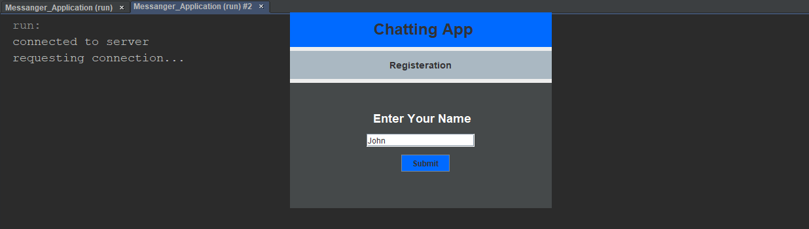
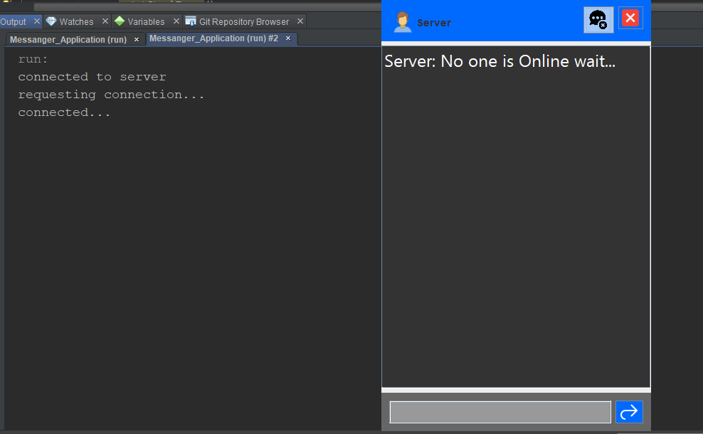
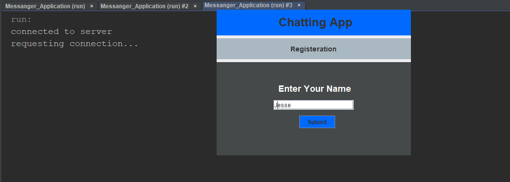
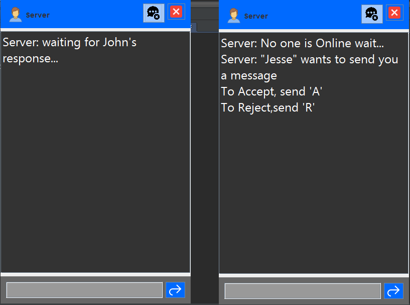
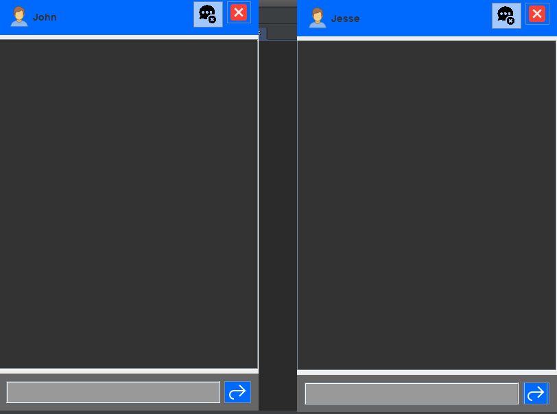
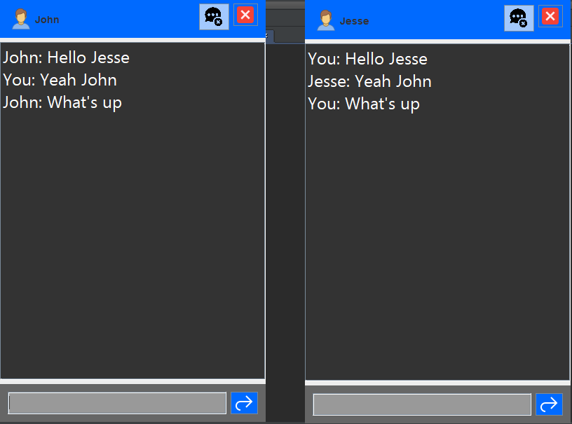
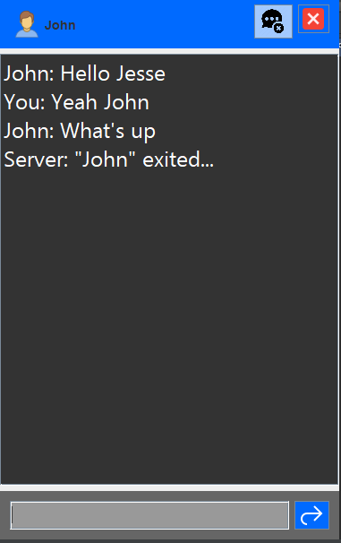
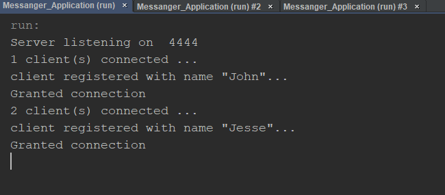

# 					[Messanger_Application](https://github.com/AazamJutt/Messanger_Application/)

### Developed By [Aazam Jutt](https://github.com/AazamJutt)

## Description

* It uses a simple server that creates a Thread as a ChatHead between clients. 
* It uses some commands for inter-server-client communication to perform and action.
* When client connects to server and ask for connection, Server ask for the name of client and registers it in local data structure (Dictionary) along with a socket connected to the client. 
* In this Dictionary Client's name act as a Key and its Socket is the value. 
* When 1st client arrives and No one is online, Server sends a message to client that "No one is online wait...". 
* When 2nd client arrives, Server registers it and displays "Online Clients" page to him/her. When client select one of the online clients. Server starts a ChatHead as a thread. Server recieves Messages from a client and sends it to another client.

## Tutorial

* Run the Server file. Server starts listening

* Run the Client File. Registeration form appears.Register with name and press submit.

* Server sends a message to Client, that no one is Online.

* If you are running it on the same machine. Run Client file  a 2nd time and register again.

* If any Client is Online. Server shows it in the Online Client window

* When  you Click any of the client. Server sends a request to that client with a proper message.

* When other client accepts the Request chat starts between the Clients and both clients' status is set to Busy, no other client will see these client in their online client window.

* A visualization of inter-cient chatting.

* If one of the client presses (X) or end_Chat button. other client recieves a message.

.

* Server side behaviour during all this processing.

## Bugs Yet to be fixed

* Handle, Removing clients from server data structure.
* Handle, Thread-safe variable. i.e. Critical Section Management between Threads.
